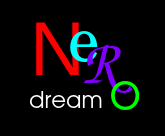

<p align="center">
  
</p>

<h1 align="center"> NeroDream: DeepDream remix </h1>

## Installation
Notes:
- **Build on the OS you're targeting**:
  Running this on Ubuntu box produces a Linux binary, and running on Windows will produce an `.exe`.
- The first time you run the CLI with a given `--model`, torchvision downloads 
  its pretrained ImageNet weights automatically (needs internet, one-time per 
  model) and caches them to `~/.cache/torch/hub/checkpoints/`.
- All 8 registered models are bundled (~1.4GB of weights alone); trim
  `AVAILABLE_MODELS` in `deepdream/models.py` for reducing this.
- Only CPU build available.


1. Install Python, check "Add python.exe to PATH" during installation. Verify later in cmd.exe:
```powershell
python --version
```

2. Create and activate a fresh venv (from inside the project folder, cmd.exe)
```powershell
python -m venv .venv
.venv\Scripts\activate
```
for Linux, this is
```bash
source .venv/bin/activate
```

3. Install dependencies
```powershell
pip install -r requirements.txt
```

4. Download all model weights locally (one-time, needs internet, ~1.4GB)
```powershell
python scripts\prefetch_models.py
```

5. Build the package
```powershell
pyinstaller nerodream.spec
```

6. Run it
```powershell
dist\NeroDream\NeroDream.exe
```
Output lands in dist\NeroDream\ - NeroDream.exe, along with its dependencies.


## Desktop UI
```bash
python gui.py
```
A PyQt6 window over the same `deepdream.core`/`.image_utils`/`.models`
building blocks the below CLI uses -- pick a source (and optional guide) image,
tweak the same params as the CLI flags, hit Dream. The dream runs on a
background thread so the window doesn't freeze, with progress dots
stream into an on-screen log panel instead of the terminal.


## Run the dreamer CLI

Basic run (default model is inception_v3)
```bash
python cli.py --image your_photo.jpg
```
See every hookable layer name for a model (useful for finding your own
favorite layer to maximize):
```bash
python cli.py --model vgg16 --list-layers
```
More params; Custom run:
```bash
python cli.py --image your_photo.jpg --model vgg16 --layer features.17 --octaves 5 --iterations 20
```


## Run the tests
```bash
pytest tests/ -v
```
These 14 tests only touch `image_utils.py` and `core.py`, which don't import
torch at all -- they run in well under a second and don't need any model
downloaded. `models.py` is 'tested' by looking at the output image.


## Image size notes

- `--max-size` (default 768px longest side) controls speed -- on CPU-only,
  a few hundred px keeps a full run to seconds-to-low-minutes.
- The **smallest octave** matters more than the input size: some models
  (`inception_v3`, `googlenet`, `resnet50`, `efficientnet_b0`) start failing or degrading once their
  smallest octave drops below ~64-75px, because internal pooling can shrink
  a feature map to nothing. `mobilenet_v2`/`v3`/`vgg16`/`vgg19` tolerate much
  smaller. The CLI throws a warning if your settings go below a
  model's recommended minimum -- fixed by lowering `--octaves` or
  `--octave-scale`.


## Where to get more models

Every model below is already wired up by name in `deepdream/models.py` --
just pass `--model <name>`. To add more later, these are the libraries to
pull from:

- **torchvision** (what this project uses): https://pytorch.org/vision/stable/models.html -- the full list of pretrained classifiers, all auto-downloading via the same `weights=...Weights.DEFAULT` pattern used in `models.py`.
- **Keras Applications** (if ever porting to TensorFlow/TF.js): https://keras.io/api/applications/ -- same set of architectures (InceptionV3, VGG, MobileNet, EfficientNet, ResNet, Xception), auto-downloads to `~/.keras/`.
- **timm** (PyTorch Image Models, by Ross Wightman): https://github.com/huggingface/pytorch-image-models -- 900+ architectures.
- **ONNX Model Zoo**: https://github.com/onnx/models -- pretrained `.onnx` files directly for ONNX Runtime Web.

Currently registered (`--model` value, approx. download size, character):

| name | size | note |
|---|---|---|
| `mobilenet_v2` | 14 MB | fastest, most forgiving of small octaves -- the default |
| `mobilenet_v3_large` | 22 MB | similar to v2, slightly different bias |
| `efficientnet_b0` | 20 MB | good quality-per-MB, less battle-tested for dreaming |
| `googlenet` | 50 MB | same lineage as the original DeepDream network |
| `resnet50` | 98 MB | residual connections, more abstract look |
| `inception_v3` | 104 MB | the original DeepDream backbone, classic look |
| `vgg16` | 528 MB | clean conv stack, also the standard style-transfer backbone |
| `vgg19` | 548 MB | deeper VGG, richer textures, biggest download |
